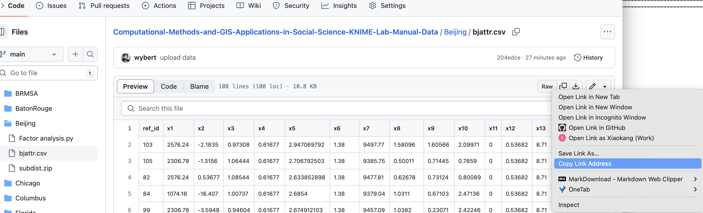

## Data for the KNIME Lab Manual

For the file `residential.zip` in `Chicago/ZoneEffect`, please use this link:

https://github.com/spatial-data-lab/Computational-Methods-and-GIS-Applications-in-Social-Science-KNIME-Lab-Manual-Data/releases/download/v1.0/residential.zip

Other data, get the link by navigating to the file and right-clicking on the `Raw` button and selecting `Copy Link Address`:

